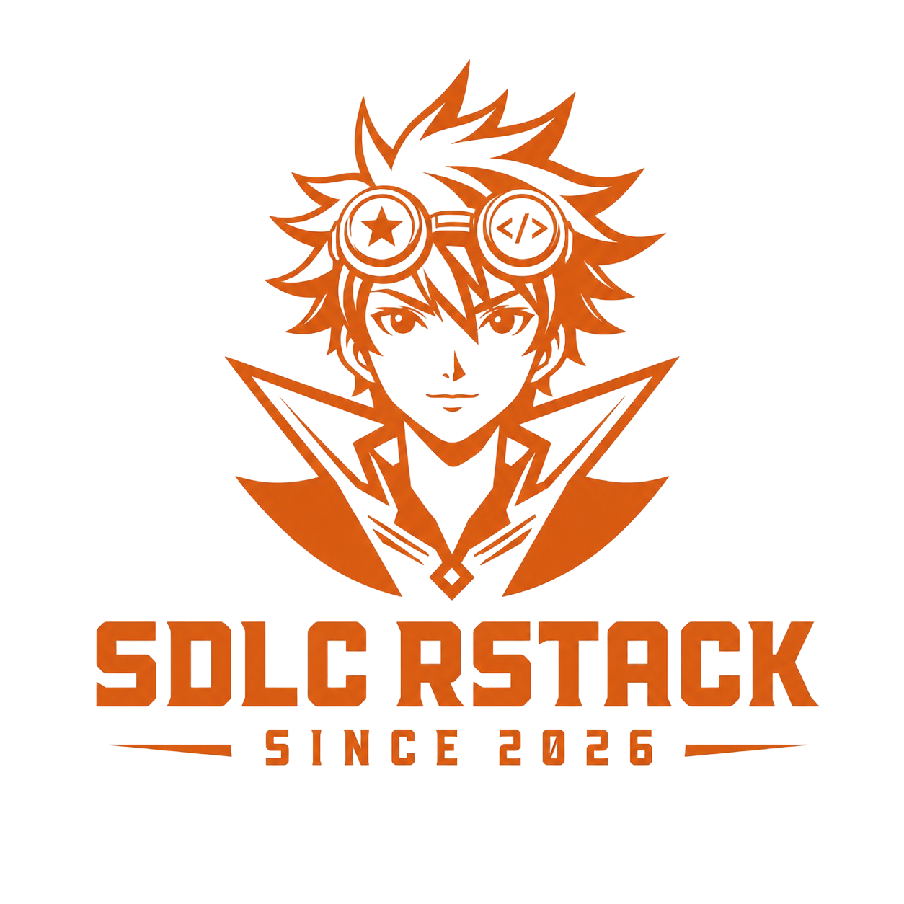

# RStack SDLC

<!-- owner: RStack developed by Richardson Gunde -->

<p align="center">
  
</p>

<p align="center">
  <strong>A governed AI-SDLC operating layer for any coding framework.</strong><br/>
  Since 2026 &nbsp;·&nbsp; MIT &nbsp;·&nbsp; <a href="https://github.com/richard-devbot/SDLC-rstack">richard-devbot/SDLC-rstack</a>
</p>

<p align="center">
  
  
  
  
</p>

---

RStack sits on top of Pi, Claude Code, Operator, Codex-style CLIs, Gemini-style CLIs, or a custom harness and gives agent teams a repeatable lifecycle with approvals, builder/validator contracts, evidence, memory, budget envelopes, and a live Business Hub.

```text
clarify → plan → spec → approve → build → validate → release-readiness → learn
```

## Table of contents

- [Quick start](#quick-start)
- [Choose your framework](#choose-your-framework)
- [Configure your team](#configure-your-team)
- [Agent identity and standby automation](#agent-identity-and-standby-automation)
- [Upgrade path](#upgrade-path)
- [Start your first governed run](#start-your-first-governed-run)
- [What init creates](#what-init-creates)
- [Builder and validator sandbox model](#builder-and-validator-sandbox-model)
- [Business Hub](#business-hub--live-observability-on-3008)
- [CLI reference](#cli-reference)
- [Known limitations and roadmap](#known-limitations--roadmap)
- [Documentation](#documentation)
- [Development](#development)

---

## Quick start

> **New here? [RStack in 5 Minutes](docs/quick-start-guide.md)** — install to a
> validated, human-approved pipeline task from a bare terminal, no framework required.

```bash
cd your-project
npm install rstack-agents
npx rstack-agents init --profile business-flex
```

`init` auto-detects `pi | claude-code | operator | custom`, creates `.rstack/`, scaffolds bootstrap files (`SOUL.md`, `HEARTBEAT.md`, and framework-specific `CLAUDE.md` or `AGENTS.md`), registers the project with the Business Hub, writes framework glue, and **never overwrites existing files**.

If `.rstack/` already exists, `init` adopts it and preserves all prior runs. To start clean instead (nothing is deleted):

```bash
npx rstack-agents init --fresh   # archives prior state to .rstack/archive/<timestamp>/
```

Pick a profile size:

```bash
npx rstack-agents init --profile lean-mvp
npx rstack-agents init --profile enterprise-webapp
```

| Profile | Best for | Result |
|---|---|---|
| `business-flex` | Most business/product teams | Product, backend, frontend, QA, security, devops, docs, budget policy, Business Flex dashboard |
| `lean-mvp` | Fast prototypes | Smaller full-stack team and lower budget defaults |
| `enterprise-webapp` | Heavier governance | Enterprise web app team with security/compliance/devops emphasis |

---

## Choose your framework

RStack is a plugin layer — install your AI coding framework first, then run `init`.

| Framework | Integration | Bootstrap files | Harness entry |
|---|---|---|---|
| **Pi** | Native adapter | `SOUL.md`, `HEARTBEAT.md` | `sdlc_start(goal="...")` |
| **Claude Code** | First-class | `CLAUDE.md`, `SOUL.md`, `HEARTBEAT.md` | `/sdlc-start` or orchestrator |
| **Operator** | Python bridge | `SOUL.md`, `HEARTBEAT.md` | Operator extension + Node bridge |
| **Codex / custom** | Asset + bridge | `AGENTS.md`, `SOUL.md`, `HEARTBEAT.md` | Node bridge or prompt-driven |

| Framework | What you get |
|---|---|
| Pi | All 15 `sdlc_*` tools, lifecycle hooks, tool gating, auto-launch dashboard |
| Claude Code | Usage guide, optional SessionStart hook, slash commands via plugin |
| Operator | Python adapter shells out to the same Node harness |
| Codex / Gemini / custom | `.rstack/` state contract, agents/skills as context, CLI bridge |

Per-framework setup: [docs/mintlify/getting-started/install-your-framework.mdx](docs/mintlify/getting-started/install-your-framework.mdx)

Custom harness bridge:

```bash
RSTACK_PROJECT_ROOT="$(pwd)" \
  npx tsx node_modules/rstack-agents/bin/rstack-operator-bridge.ts sdlc_start '{"goal":"..."}'
```

Full contract: [docs/integrations/custom.md](docs/integrations/custom.md)

---

## Configure your team

RStack ships a large catalog (196 agents, 156+ skills, 72 plugins), but you configure only what your project needs.

### 1. Pick a profile

Profiles write `.rstack/rstack.config.json` and `.rstack/budget.json`:

```bash
npx rstack-agents init --profile business-flex   # default for most teams
npx rstack-agents init --profile lean-mvp        # prototypes
npx rstack-agents init --profile enterprise-webapp # compliance-heavy delivery
```

### 2. Narrow domains and plugins

Edit `.rstack/rstack.config.json` any time:

```json
{
  "profile": "business-flex",
  "enabled_domains": ["product", "backend", "qa", "security", "docs"],
  "enabled_plugins": [
    "business-analytics",
    "backend-development",
    "unit-testing",
    "security-scanning",
    "documentation-generation"
  ],
  "dashboard_pages": ["command", "business-flex", "workflow", "agent-work", "live-feed", "approvals"]
}
```

When `sdlc_plan` runs, each task gets active profile, routing explanation, and budget envelope.

### 3. Add plugins locally

Copy one plugin pack into your project:

```bash
npx rstack-agents add plugin unit-testing
npx rstack-agents add plugin security-scanning
```

Plugins land in `.rstack/plugins/<name>/`.

### 4. Browse the catalog

```bash
npx rstack-agents list agents
npx rstack-agents list skills
npx rstack-agents list plugins
```

### 5. Project-local overrides

Drop custom assets in `.rstack/` — they take precedence over package defaults:

```text
.rstack/agents/     custom agent definitions
.rstack/skills/     custom skills
.rstack/plugins/    custom or copied plugin packs
.rstack/prompts/    custom prompts
```

Then validate: `npx rstack-agents validate`

<details>
<summary>Current package limitation</summary>

Profiles guide routing, budget, dashboard visibility, and project-local configuration. The npm package still ships the full catalog so offline/project-local routing works. The next product step is a pack installer that physically copies only selected packs into `.rstack/` for stricter enterprise footprints.

</details>

---

## Agent identity and standby automation

| File | Purpose |
|---|---|
| **SOUL.md** | Governance identity — orchestrator/builder/validator roles, evidence rules, profile awareness |
| **HEARTBEAT.md** | Optional periodic checks — pending approvals, budget burn, stalled tasks, validation retries |
| **CLAUDE.md** | Claude Code bootstrap — asset paths, slash commands, optional hooks |
| **AGENTS.md** | Codex/universal bootstrap — same rules plus skill routing and Node bridge |

`init` scaffolds these from `templates/bootstrap/` when missing. Canonical templates live in the package at `node_modules/rstack-agents/templates/bootstrap/`.

### Hooks (optional, on standby)

RStack does not require hooks. Enable only what you want:

| Hook | What it does | How to enable |
|---|---|---|
| Claude SessionStart | Auto-launch Business Hub on session start | Merge `.claude/rstack-hub-hook.json` into `.claude/settings.json` |
| Pi lifecycle | Tool gating, stage events, contract enforcement | Automatic when using Pi extension |
| HEARTBEAT.md | Periodic approval/budget/stall checks | Wire into your harness cron or idle trigger |

Disable hub auto-launch:

```bash
export RSTACK_NO_BUSINESS_HUB=1   # skip hub spawn
export RSTACK_NO_BROWSER=1        # hub may start but no browser tab
export RSTACK_BUSINESS_PORT=3008  # change port
```

---

## Upgrade path

Start small and expand as requirements grow:

```text
lean-mvp  →  business-flex  →  enterprise-webapp
```

| Stage | When | Action |
|---|---|---|
| **lean-mvp** | Prototypes, internal tools | `init --profile lean-mvp` — lower budgets, fewer domains |
| **business-flex** | Client/product delivery | Add domains/plugins in `rstack.config.json`, raise budget in `budget.json` |
| **enterprise-webapp** | Compliance-heavy web apps | `init --profile enterprise-webapp` or enable security/compliance plugins |

Upgrade steps (no reinstall required):

1. Edit `.rstack/rstack.config.json` — add `enabled_domains`, `enabled_plugins`, `dashboard_pages`
2. `npx rstack-agents add plugin <name>` — copy needed plugin packs locally
3. Adjust `.rstack/budget.json` — raise thresholds as team size and scope grow
4. `npx rstack-agents validate` — refresh registry after changes

---

## Start your first governed run

From the host AI framework session:

```text
sdlc_start(goal="Upgrade this app, add required tests, improve docs, and run a security review")
sdlc_clarify()
sdlc_plan()
```

Approve gates, then build and validate:

```text
sdlc_approve(artifact="plan.md", status="APPROVED")
sdlc_approve(artifact="requirements.json", status="APPROVED")
sdlc_approve(artifact="architecture.md", status="APPROVED")
sdlc_build_next()
sdlc_validate()
```

---

## What init creates

```text
your-project/
├── CLAUDE.md or AGENTS.md   # framework bootstrap (if missing)
├── SOUL.md                  # governance identity (if missing)
├── HEARTBEAT.md             # standby automation guide (if missing)
├── .rstack/
│   ├── rstack.config.json   # active profile, enabled domains/plugins, dashboard pages
│   ├── budget.json          # run/daily/monthly budget, warnings, approval thresholds
│   ├── runs/                # every governed run lands here
│   ├── registry/            # agents, skills, plugins, routing metadata
│   └── policy.json          # optional approval policy you control
└── framework glue           # e.g. .claude/rstack-sdlc.md or Operator template
```

Every run records its manifest, plan, tasks, approvals, evidence, events, stage artifacts, builder contracts, validator contracts, and metrics under `.rstack/runs/<run-id>/`.

---

## Builder and validator sandbox model

RStack uses scoped task packets instead of giving every worker the whole project and whole catalog.

| Role | Tools | Must write | Rule |
|---|---|---|---|
| Orchestrator | planning/status tools | `plan.md`, `tasks.json`, specs | Routes work; does not directly implement |
| Builder | read, bash, edit, write, grep, find, ls | `builder.json` | Changes only task-scoped files; runs checks before claiming done |
| Validator | read, grep, find, ls | `validation.json` | Read-only review; no mutation |

Builder contract:

```json
{
  "task_id": "003-architecture",
  "agent": "builder",
  "status": "PASS|FAIL|BLOCKED|DONE_WITH_CONCERNS",
  "summary": "",
  "files_modified": [],
  "tests_run": [],
  "risks": [],
  "next_steps": []
}
```

Contract v2 can also capture backend visibility:

```json
{
  "execution": { "tools_used": [], "events": [], "artifacts_written": [] },
  "cost": { "currency": "USD", "estimated_usd": 1.5, "actual_usd": 1.2 },
  "context": { "profile": "business-flex", "workflow": "production-business-sdlc" },
  "routing": { "selected_by": "profile-domain-stage-affinity", "explanation": [] }
}
```

Validator contract:

```json
{
  "task_id": "003-architecture",
  "validator": "rstack-validator",
  "status": "PASS|FAIL",
  "checks": [],
  "issues": [],
  "retry_recommendation": "none|retry_builder|ask_user|block"
}
```

---

## Business Hub — live observability on :3008

```bash
npx rstack-agents hub
```

The dashboard derives everything from real `.rstack` files — no fake demo state and no telemetry leaving your machine.

| Page | What you get |
|---|---|
| **Command Center** | Portfolio status, attention signals, stage health, live activity |
| **Business Flex** | Active profiles, enabled domains, budget guardrails, routing proof |
| **Studio / Studio 3D** | Agent workspace with live stage status and clickable agent panels |
| **Projects & Runs** | Every run and its actual deliverables |
| **Run Analytics** | Stage timing, Gantt, trend rows |
| **Agent Work** | Builder/validator contracts and evidence |
| **Approvals / Alerts** | Human gates, guardrails, spend/stall signals |
| **Traceability** | Requirement → stage → task → evidence chains |

---

## CLI reference

| Command | Purpose |
|---|---|
| `rstack-agents init --profile business-flex` | Set up profile, budget, bootstrap files, framework glue, and Business Hub registry |
| `rstack-agents init --fresh` | Archive prior `.rstack/` state and start clean |
| `rstack-agents hub` | Start/open the dashboard |
| `rstack-agents list agents\|skills\|plugins` | Browse packaged catalog |
| `rstack-agents add plugin <name>` | Copy a packaged plugin into `.rstack/plugins/` |
| `rstack-agents notify --test` | Test Slack/Teams/Discord/Telegram/WhatsApp notifications |
| `rstack-agents validate` | Validate packaged and local agent definitions |
| `rstack-business --port 3008 --project .` | Run the dashboard directly |

---

## Known limitations and roadmap

### Current limitations

- **Actual token/cost capture:** host frameworks execute model calls, so real usage needs host-side reporting or provider adapters.
- **Physical pack pruning:** profiles narrow routing today; a future pack installer should reduce project-local agent/plugin footprint.
- **Validator enforcement:** validator tool policy is encoded in RStack packets, but strict enforcement depends on the host sandbox.
- **MCP/A2A:** `.rstack` is adapter-friendly, but a native MCP/A2A server is still a future slice.

### Roadmap — v1.9.0 (contributions welcome)

| # | Feature | Status |
|---|---------|--------|
| [Phase 0](docs/github-issues/PHASE-0-harness-bridge.md) | **Harness ↔ Loop Runner Bridge** — SDLC agents emit `builder.json`/`validation.json` to the harness run directory | 🗺 planned |
| [Phase 1](docs/github-issues/PHASE-1-pipeline-state.md) | **Pipeline State & Restart Recovery** — resume-aware pipeline runner, skip DONE stages | 🗺 planned |
| [Phase 2](docs/github-issues/PHASE-2-retry-validation.md) | **Per-Agent Retry + Maker/Checker Validation** — retry wrapper, Haiku validator agents | 🗺 planned |
| [Phase 3](docs/github-issues/PHASE-3-goal-loop.md) | **Goal Condition + True Pipeline Loop** — loop until `consistency_score >= 90` | 🗺 planned |
| [Phase 4](docs/github-issues/PHASE-4-cost-observability.md) | **Cost Tracking & Observability** — cost footer standard, per-stage cost report | 🗺 planned |
| [Phase 5](docs/github-issues/PHASE-5-parallel-safety.md) | **Parallel Safety & Worktree Isolation** — git worktree for code agent | 🗺 planned |
| — | Pack installer — physically copy only selected packs into `.rstack/` | 🗺 future |

See [`docs/github-issues/`](docs/github-issues/) for detailed issue specs. See [`docs/LOOP-ENGINEERING-UPGRADE-PLAN.md`](docs/LOOP-ENGINEERING-UPGRADE-PLAN.md) for the full design.

**Contributions are welcome.** Read [`CONTRIBUTING.md`](CONTRIBUTING.md) for branching rules, CI requirements, IP policy, and CodeRabbit guidelines before opening a PR.

---

## Documentation

### Bootstrap templates

Canonical copies in [`templates/bootstrap/`](templates/bootstrap/):

- [`SOUL.md`](templates/bootstrap/SOUL.md) — governance identity
- [`HEARTBEAT.md`](templates/bootstrap/HEARTBEAT.md) — standby automation
- [`CLAUDE.md`](templates/bootstrap/CLAUDE.md) — Claude Code bootstrap
- [`AGENTS.md`](templates/bootstrap/AGENTS.md) — Codex/universal bootstrap
- [`GEMINI.md`](templates/bootstrap/GEMINI.md) — Gemini CLI pointer

### Mintlify docs

Full docs in [`docs/mintlify`](docs/mintlify):

- [Quickstart](docs/mintlify/quickstart.mdx)
- [Install your framework](docs/mintlify/getting-started/install-your-framework.mdx)
- [Business Flex Profiles](docs/mintlify/getting-started/business-flex-profiles.mdx)
- [Builder & Validator Sandbox](docs/mintlify/getting-started/builder-validator-sandbox.mdx)
- [Configuration reference](docs/mintlify/reference/configuration.mdx)
- [Business Hub](docs/mintlify/reference/business-hub.mdx)
- [AI SDLC Trends & Loopholes](docs/mintlify/reference/loopholes-roadmap.mdx)

### Harness and integrations

- [Harness contract](docs/HARNESS.md) — stages, contracts, evidence, guardrails
- [Custom integration](docs/integrations/custom.md) — Node bridge and state contract

Research material: [`research/`](research/). Architecture decisions: [`rfcs/`](rfcs/).

---

## Development

```bash
git clone https://github.com/richard-devbot/SDLC-rstack.git
cd SDLC-rstack
npm install
npm test
npm run lint
npm run validate
```

Latest verified branch state:

```text
npm test          # 357 pass, 0 fail
npm run lint      # pass
npm run validate  # All 196 agents passed validation
npm pack --dry-run  # package includes templates/bootstrap/
```

## License

MIT © Richardson Gunde
